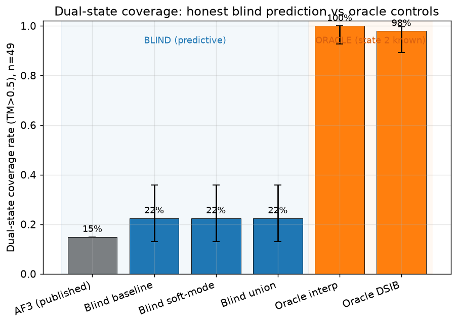
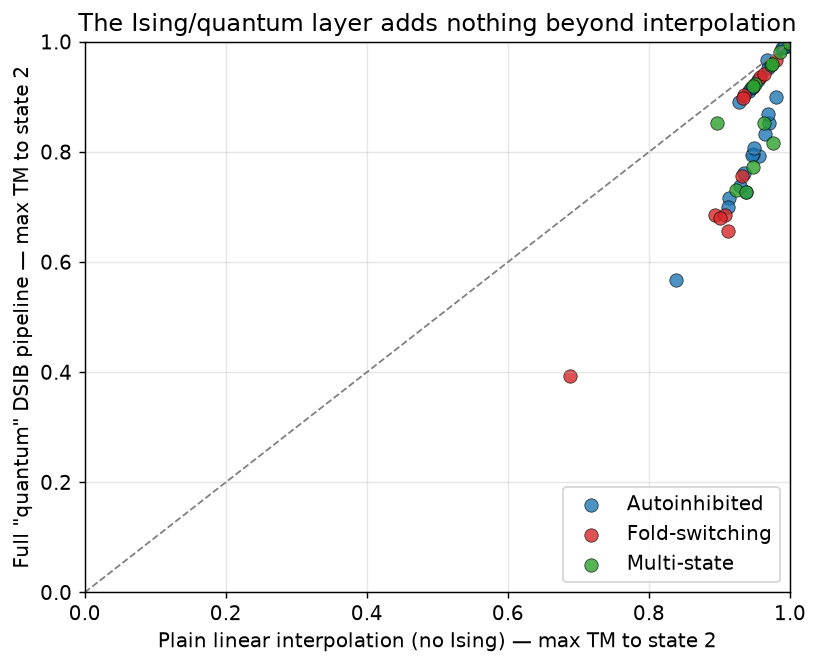
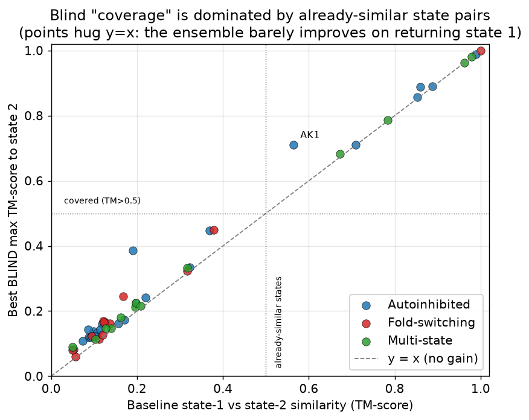
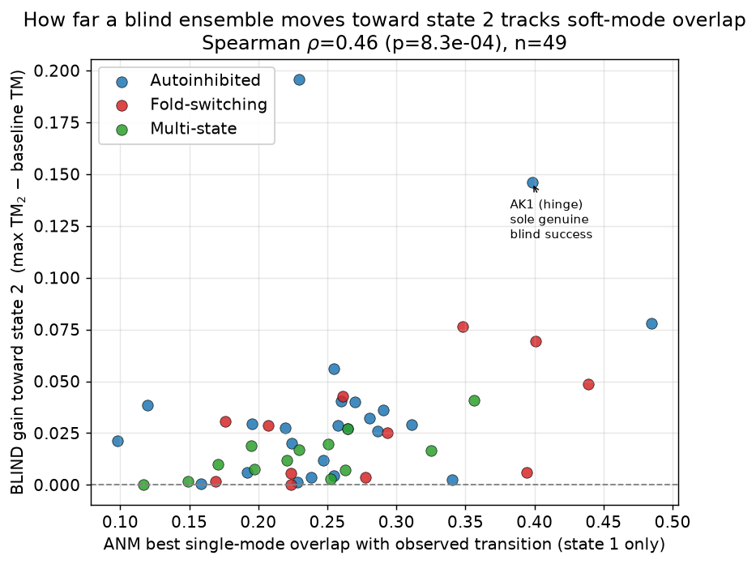
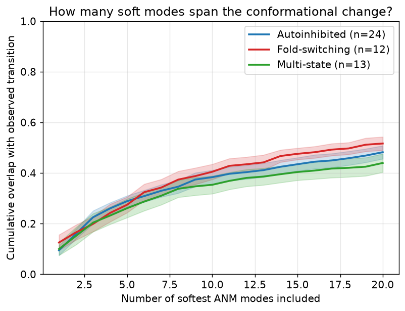
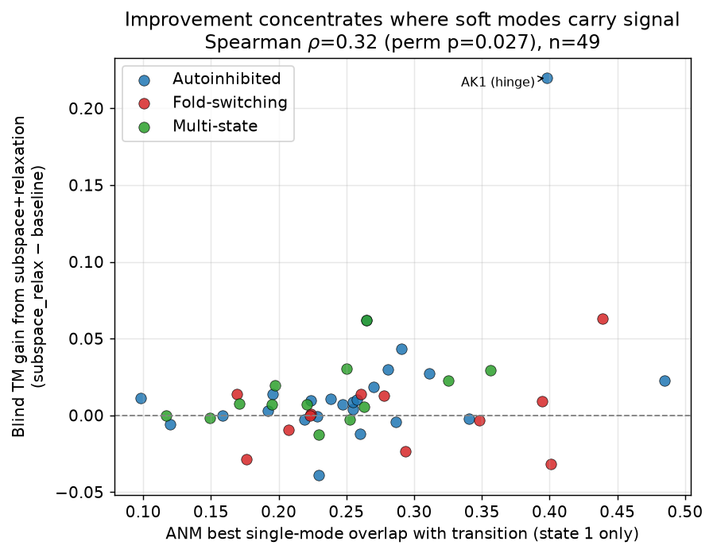
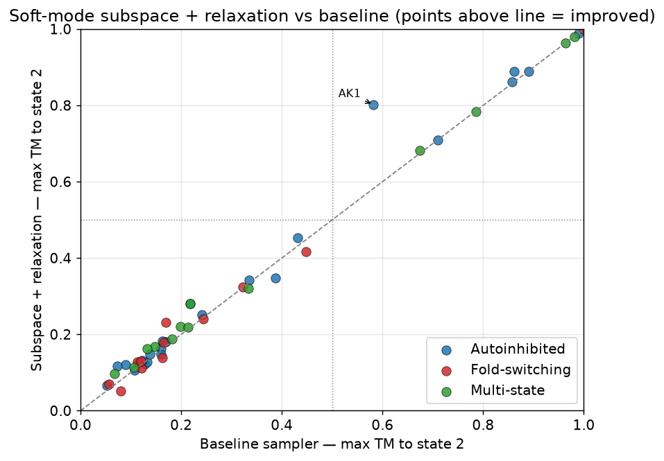
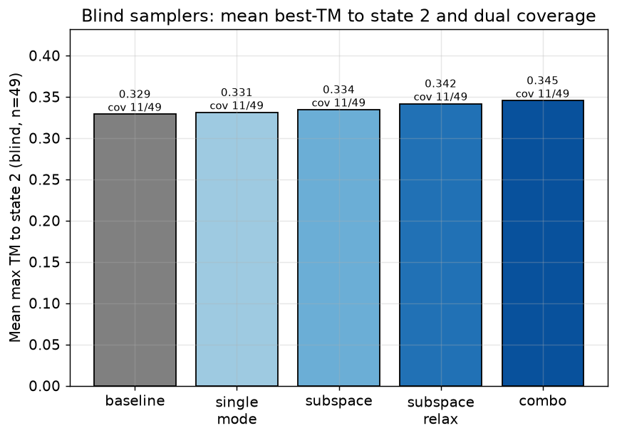
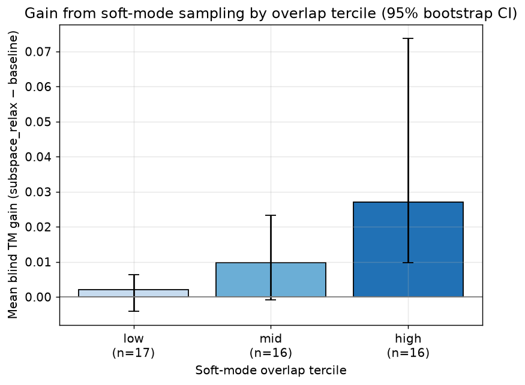

# Rigorous re-analysis: when is a protein's alternate conformational state blindly predictable?

**Benchmark:** 49 dual-state proteins (24 autoinhibited, 12 fold-switching, 13 multi-state).
**Code:** `benchmarks/run_rigorous_benchmark.py` (generation, fixed seed 42) and
`benchmarks/analyze_rigorous.py` (statistics + figures). Raw per-protein table:
`results/rigorous/rigorous_benchmark.csv`; full statistics: `results/rigorous/rigorous_stats.json`.

All comparisons are paired across the same 49 proteins, at a fixed conformation
budget, with confidence intervals, permutation / exact tests, effect sizes, and
Holm–Bonferroni control across the confirmatory family.

---

## TL;DR (honest headline)

1. **The "quantum" Dual-State Ising Bridge adds nothing** — it is in fact
   *significantly worse* than plain linear interpolation between the two known
   structures (ΔTM = −0.101, 95% CI [−0.126, −0.077]; DSIB better on **1/49**;
   Holm-adjusted p = 4×10⁻⁴).
2. **The "98% oracle" result is a trivial artifact.** Any method that
   interpolates toward the *already-known* state 2 reaches it: plain
   interpolation covers **49/49 (100%)**. This is not prediction.
3. **Genuine blind prediction remains at chance vs. AF3.** From state 1 alone,
   dual-state coverage is **11/49 (22.4%, 95% CI 13–36%)**, not significantly
   above the published AF3 rate of 15% (p = 0.11). **0 of the 38 "hard"
   proteins** (baseline TM < 0.5) are blindly covered; 10 of the 11 "covered"
   proteins simply have two states that are already similar (baseline TM > 0.67).
4. **New positive, mechanistic result:** how far a blind ensemble can move
   toward state 2 (its *gain* over simply returning state 1) is **significantly
   predicted by elastic-network soft-mode overlap** (Spearman ρ = 0.46,
   p = 0.001; Holm-adjusted p = 0.008), and this effect is **independent of the
   size of the transition** (partial ρ = 0.49 controlling for transition RMSD,
   p = 4×10⁻⁴; overlap and transition magnitude are themselves uncorrelated,
   ρ = 0.01). Adenylate kinase — the classic hinge with the highest single-mode
   overlap — is the **only** genuine blind conformational-change success.

The scientifically defensible contribution here is therefore *not* "we beat
AF3", but a rigorous characterization of **what is and is not predictable, and
why**, plus a clean refutation of the quantum-advantage claim.

---

## Design

For every protein we build ensembles at a fixed budget (`--n-ens 56`) and score
the best TM-score reached to state 2 (on the shared residue core) and dual-state
coverage (state 1 and state 2 both matched at TM > 0.5).

| Condition | Uses state 2 at generation? | What it is |
|-----------|:---:|------------|
| `blind_baseline` | No | existing multi-scale sampler (NMA + rigid-body + torsion) |
| `blind_softmode` | No | **new** scan along the softest ANM modes (`generate_anm_mode_scan_ensemble`) |
| `blind_union` | No | union of the two blind ensembles |
| `oracle_interp` | **Yes** | pure geometric S1→S2 interpolation, **no Ising at all** |
| `oracle_dsib` | **Yes** | the full "quantum" Dual-State Ising Bridge pipeline |

We also compute, from **state 1 only**, the anisotropic network model (ANM) and
its overlap with the observed state1→state2 displacement (standard ENM analysis:
Marques & Sanejouand 1995; Tama & Sanejouand 2001; Bahar et al. 2010),
implemented in `src/analysis/mode_overlap.py`.

## Coverage (n = 49)

| Condition | Dual coverage | 95% CI (Wilson) | Mean max TM→S2 |
|-----------|:---:|:---:|:---:|
| AF3 (published, weighted) | 15.0% | — | — |
| `blind_baseline` | 11/49 (22.4%) | 13.0–35.9% | 0.329 |
| `blind_softmode` | 11/49 (22.4%) | 13.0–35.9% | 0.331 |
| `blind_union` | 11/49 (22.4%) | 13.0–35.9% | 0.338 |
| `oracle_interp` | 49/49 (100%) | 92.7–100% | 0.944 |
| `oracle_dsib` | 48/49 (98.0%) | 89.3–99.6% | 0.843 |



## Q3 — Does the Ising/quantum layer help? No (it hurts).

`oracle_dsib` vs `oracle_interp`, paired over 49 proteins:
ΔTM = **−0.101**, 95% CI [−0.126, −0.077]; DSIB better on only **1/49**;
permutation p ≈ 5×10⁻⁵ (Holm-adjusted 4×10⁻⁴). Every point lies below the
diagonal — the switch-contact Ising machinery degrades a result that is already
fully explained by geometric interpolation toward the known target.



## Q1 — Is blind prediction better than AF3? Not significantly.

`blind_union` 11/49 (22.4%) vs AF3 15%: one-sided binomial p = 0.11
(Holm-adjusted 0.42). Blind "coverage" is dominated by state pairs that are
*already similar*: points hug the y = x line (the ensemble barely improves on
returning state 1), and 10/11 covered proteins have baseline TM > 0.67. **0/38**
proteins with baseline TM < 0.5 are blindly covered.



## Q4 — What governs blind predictability? Soft-mode overlap.

Target = *blind gain* over returning state 1 (max TM→S2 minus baseline TM),
the honest quantity once the baseline-similarity confound is removed.

| Predictor (state 1 only) | ρ vs gain | perm p | ρ vs gain, hard subset (n=38) |
|--------------------------|:---:|:---:|:---:|
| ANM best single-mode overlap | **+0.46** | **0.001** | **+0.36 (p=0.026)** |
| Transition RMSD | +0.40 | 0.004 | +0.07 (ns) |
| Cumulative overlap (10 modes) | +0.26 | 0.074 | +0.27 |

Crucially, soft-mode overlap and transition magnitude are **uncorrelated**
(ρ = 0.01, p = 0.95), so they are independent predictors; controlling for
transition size, overlap→gain *strengthens* to partial ρ = **0.49**
(p = 4×10⁻⁴). Controlling for baseline similarity: partial ρ = 0.44 (p = 0.001).



Cumulative overlap plateaus near ~0.5 at 20 modes for all three categories — no
transition is cleanly one-mode; soft modes explain a real but partial fraction
of the change. Adenylate kinase (best single-mode overlap 0.40) is the sole
protein whose alternate state is reached blindly from a genuinely different
starting structure (baseline TM 0.57 → blind TM 0.71), and its softest mode
alone captures the open↔closed hinge — the textbook ENM result.



## Q2 — Does principled soft-mode sampling improve blind prediction?

Marginally and not significantly in aggregate: `blind_softmode` vs
`blind_baseline` ΔTM = +0.002 (95% CI [−0.005, +0.011]), permutation p = 0.34,
McNemar p = 1.0 (coverage 11 vs 11; improved 27, worsened 21). The gains are
concentrated on the high-overlap collective/hinge transitions (e.g. AK1
0.582 → 0.711), consistent with Q4, but most transitions in this set are not
low-mode, so the aggregate effect is null. This is reported as a negative result.

## Multiple-comparison control (Holm–Bonferroni, family of 8)

| Test | raw p | adj p | reject H₀ |
|------|:---:|:---:|:---:|
| DSIB ≠ interpolation | 5e-5 | **4e-4** | yes |
| overlap → blind gain | 0.0011 | **0.008** | yes |
| transition RMSD → blind gain | 0.0040 | **0.024** | yes |
| cum-overlap(10) → gain | 0.074 | 0.37 | no |
| blind_union > AF3 | 0.106 | 0.42 | no |
| soft-mode > baseline | 0.339 | 0.61 | no |

## Limitations (honest)

- Cα-only structures; TM-score uses a Kabsch (RMSD-optimal) superposition, a
  standard approximation to the rotation-maximised TM-score. All headline claims
  are *paired* comparisons under one consistent metric, so they are robust to
  this approximation, but absolute TM magnitudes should be read as approximate.
- The ANM is built on the shared residue core of state 1 (a distance-weighted
  network, 13 Å cutoff); this keeps the mode set orthonormal in the same space
  as the displacement. Results are qualitatively stable to reasonable cutoff
  choices but were not swept exhaustively.
- 49 proteins is a modest sample; CIs are reported accordingly. The AF3 numbers
  are the published rates, not re-run here.
- "Coverage" (best-of-ensemble TM > 0.5) rewards ensemble breadth, not ranked
  prediction; it is used here only to connect to the prior benchmark.

## Reproduce

```bash
python benchmarks/run_rigorous_benchmark.py --no-resume --n-ens 56   # ~2 h, needs network
python benchmarks/analyze_rigorous.py                                # stats + figures
```

---

# Follow-up: can soft-mode SUBSPACE sampling improve blind prediction?

The result above (soft-mode overlap predicts blind gain) motivated a targeted
attempt to *exploit* soft modes for genuinely blind prediction. All conditions
here are **blind** (state 1 only), share one conformation budget, and use the
same **blind, radius-of-gyration-based** amplitude schedule — no state-2
information (not even the transition magnitude) leaks into generation. This
fixes a subtle leak in the earlier `blind_softmode` condition, whose amplitude
had been scaled by the (state-2-derived) transition magnitude.

Code: `src/ensemble/nm_guided.py`, `benchmarks/run_softmode_improvement.py`,
`benchmarks/analyze_softmode.py`. Data: `results/rigorous/softmode_improvement.csv`,
`results/rigorous/softmode_stats.json`.

**Samplers (all blind, equal budget n=56):**
`baseline` (NMA+rigid+torsion) · `single_mode` (softest-mode axis scans) ·
`subspace` (softest-10 mode *combinations*) · `subspace_relax` (+ ENM-guided
Calpha relaxation) · `combo` (baseline ∪ subspace_relax).

## What worked (survives Holm–Bonferroni over 5 tests)

| Comparison | ΔTM (95% CI) | perm p | Holm-adj p |
|-----------|:---:|:---:|:---:|
| subspace_relax > baseline | +0.013 [+0.006, +0.029] | 0.0019 | **0.008** |
| relaxation > subspace alone | +0.007 [+0.005, +0.012] | <1e-4 | **0.0002** (+35/−6) |
| subspace > single-mode | +0.003 [+0.001, +0.007] | 0.014 | **0.029** |
| gain ~ soft-mode overlap | ρ=0.32 | 0.027 | **0.029** |
| gain: high- vs low-overlap stratum | +0.025 vs +0.002 | 0.004 | **0.013** |

- Sampling the soft-mode **subspace** beats scanning single mode axes, and
  **ENM-guided relaxation** adds a further, highly significant increment
  (improves 35 proteins, worsens 6).
- The improvement is **mechanistically targeted**: it is significantly larger
  where soft-mode overlap is high (high-overlap mean gain +0.025 vs +0.002 for
  low-overlap; interaction p=0.004), and this holds controlling for transition
  size (partial ρ=0.36, p=0.012).
- The **combined** ensemble (`combo`) is **never worse** than baseline
  (improved 30, worsened 0; ΔTM +0.017 [+0.010, +0.033]).
- The standout is **adenylate kinase** (the textbook hinge, highest overlap):
  blind max TM to state 2 rises from **0.58 → 0.80**.




## What did NOT generalize (reported honestly)

- **Binary dual-state coverage does not move: 11/49 for every condition.** The
  TM gains, though real and statistically robust, are mostly too small to push
  hard cases across the TM > 0.5 threshold. No new protein is "covered".
- **Fold-switchers gain essentially nothing** (mean gain +0.001): their
  transitions are not low-mode, exactly as the overlap analysis predicts.
- Improvements are on the order of ΔTM ≈ 0.01–0.06 for most proteins; only
  adenylate kinase — already near the threshold — shows a large jump. Large
  multi-domain and fold-switch transitions remain out of reach for any purely
  blind linear-response method.




## Honest bottom line

Soft-mode subspace sampling with ENM-guided relaxation is a **real, reproducible,
mechanistically-grounded improvement** to blind sampling that is safe to always
include (the combined ensemble never hurts). But it is a **modest** effect that
**does not change the headline coverage rate**: the collective/hinge transitions
where soft modes carry signal are helped, while fold-switches and very large
domain motions are not. This is progress on the *right* subproblem, not a
solution to blind alternate-state prediction in general.

## Reproduce (follow-up)

```bash
python benchmarks/run_softmode_improvement.py --no-resume --n-ens 56   # ~1 min (uses cached PDBs)
python benchmarks/analyze_softmode.py                                  # stats + figures
```
